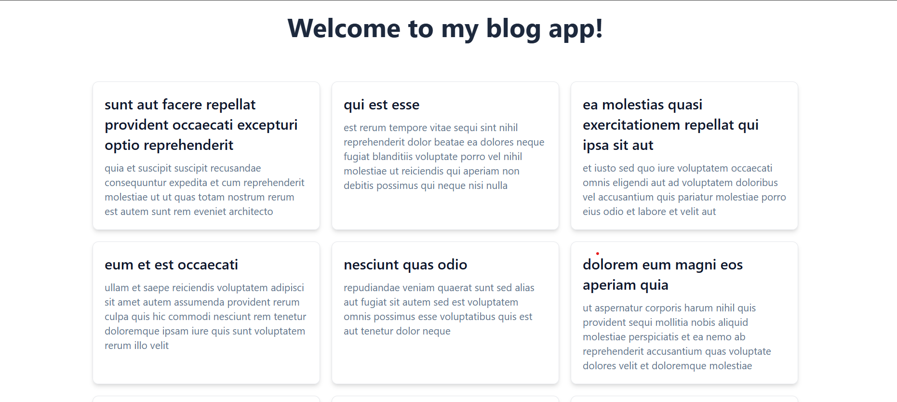

# 📝 Simple Blog App

A beginner-friendly blog web application built using **HTML**, **Tailwind CSS**, and **JavaScript**. It fetches blog post data from a public API and displays it in a responsive grid layout.

## 🚀 Live Preview
[Click here to view the live demo](https://blog-app-ten-topaz-66.vercel.app/)

---

## 📌 Features

- Fetches blog posts from a public API (`https://jsonplaceholder.typicode.com/posts`)
- Dynamically generates blog cards using JavaScript
- Responsive design using Tailwind CSS utility classes
- Smooth hover effects and transitions for a clean user experience

---

## 🛠️ Tech Stack

- HTML5
- Tailwind CSS (via CDN)
- Vanilla JavaScript (ES6+)
- JSONPlaceholder API

---

## 📂 Folder Structure

.
├── index.html # Main HTML file
├── script.js # JavaScript to fetch and render blog posts
└── README.md # Project documentation


---

## 📦 Getting Started

### Prerequisites

- A modern web browser
- Internet connection (for the Tailwind CDN and API requests)

### Steps to Run

1. Clone this repository:
   ```bash
   git clone https://github.com/Alazar-da/blog-app.git

2. Navigate into the project directory:
    ```bash
    cd blog-app

3. Open index.html in your browser.

📸 Screenshots


Example blog post layout with title and body preview styled using Tailwind CSS.

🧠 What I Learned
DOM manipulation with JavaScript

Fetching and handling asynchronous data using fetch

Responsive design using Tailwind CSS utility-first classes

Basic error handling

✍️ Author
Alazar
Frontend-focused Full-Stack Developer
📫 [Reach me on LinkedIn](https://www.linkedin.com/in/alazar-da/)
